# Generador De Memes

Este segundo proyecto estta diseñado en HTML, CSS y con mucha funcionalidad de javaScript (el principio jaja), en él hay funciones de como cargar una imagen por ejemplo, cambiar colores, poner filtros e incluí librerías externas para que pueda crearse el png con una combinación de la imagen y del DOM.

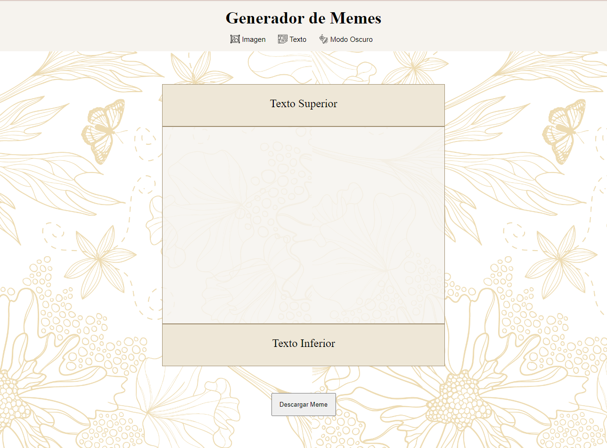

**_Cuenta con dos pestañas_**:

**1. Pestaña Imagen.**
**2. Pestaña Texto.**

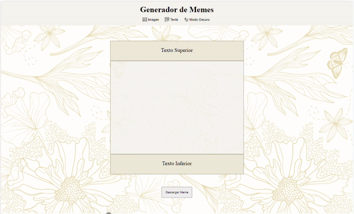

## Pestaña Imagen

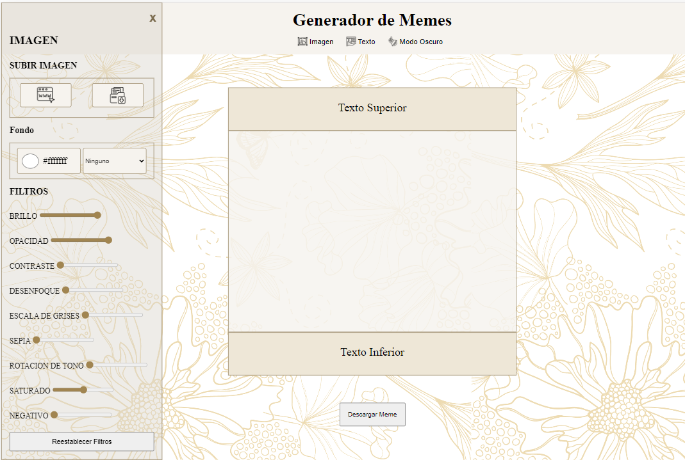

1.\_ Cuenta conbotones para subir img. ya sea de la compu o de una url.
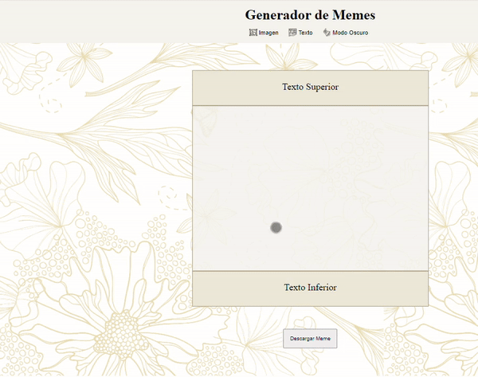

2.\_Botones para modificar el fondo.

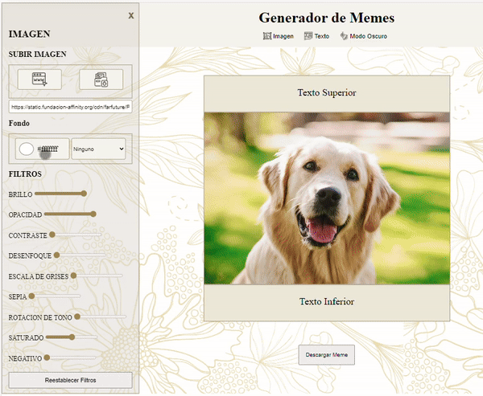

3.\_Input para el valor de los filtros.

4.\_ Y por ultimo de esta pestaña el boton para reestablecer los filtros a su valor inicial.

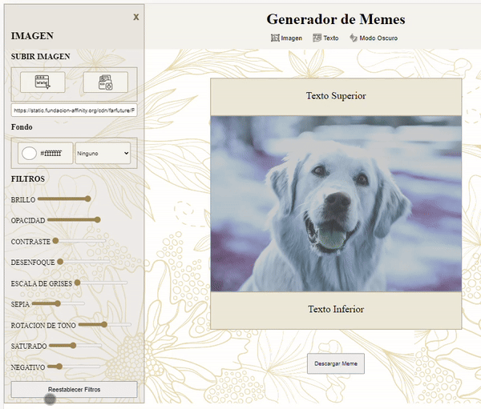

Y ovbio se puede jugar con todos juntos!!!

## Pestaña Texto

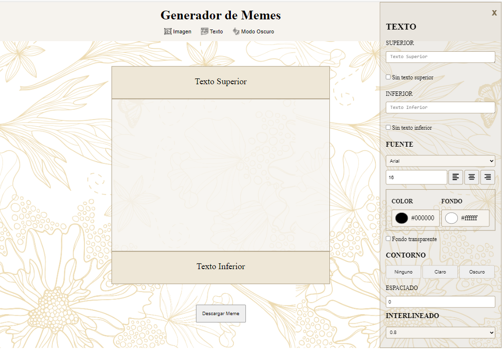

En esta pestaña se puede:

1.\_ Cambiar los textos.

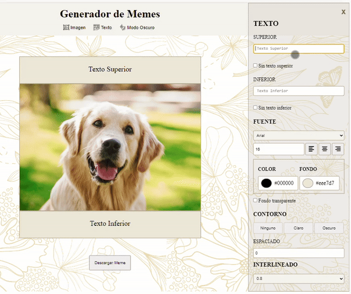

2.\_ Sacar los textos.

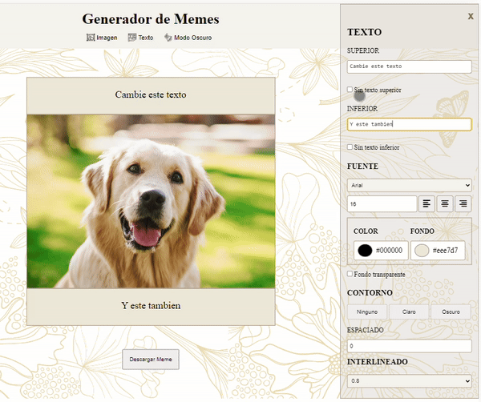

3.\_ Cambiar la fuente, el tamaño y el alineado.

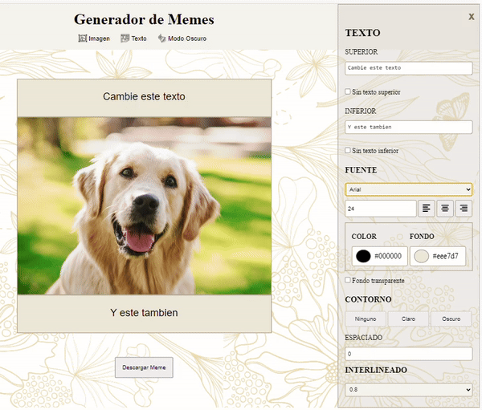

4.\_ Cambiar el color de los fondo, del texto y hacerlos tranparentes.

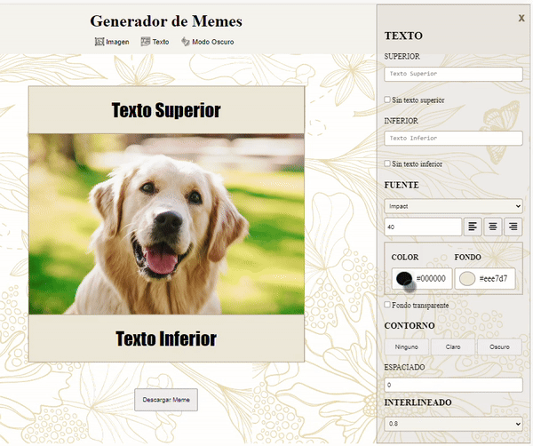

También cuenta con epaciado de letras e interlineado.

Tiene un Diseño Responsive, osea adaptable a varios tamaños de moviles y pantallas de escritorio,
El antes visto, y el de celular.
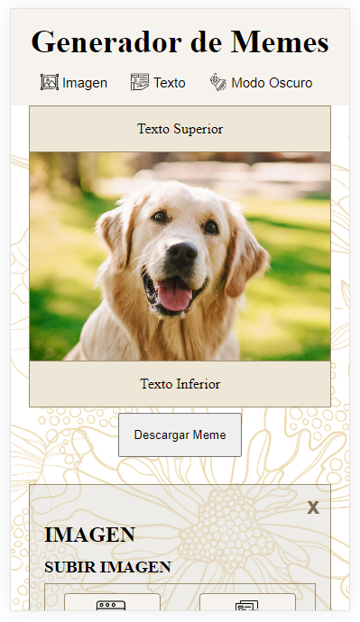

En donde podes hacer los cambios sin perder la imagen en tiempo real.

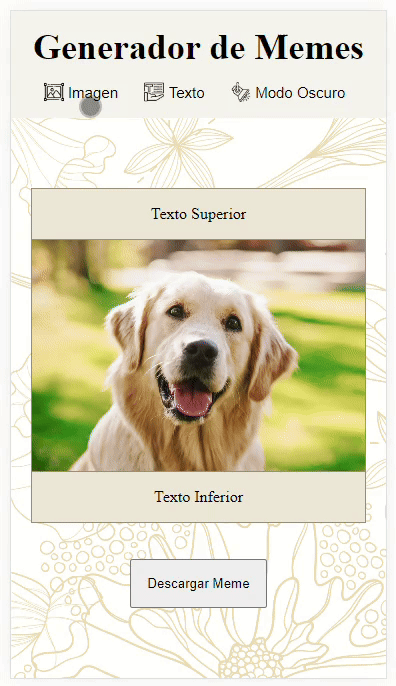

Modo Claro\_ Modo Oscuro:

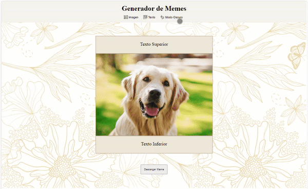

Y lo más lindo e importante es que se pueden descargar.
